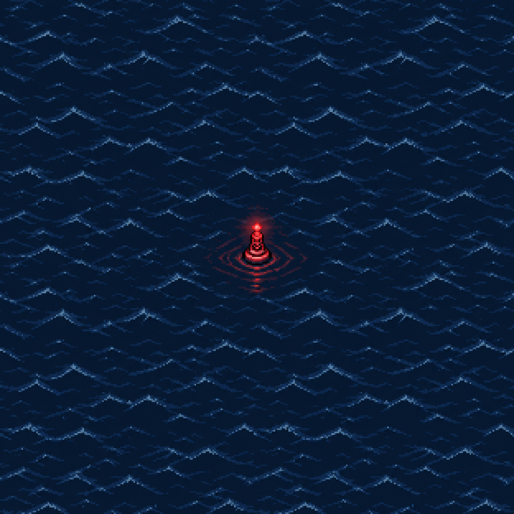
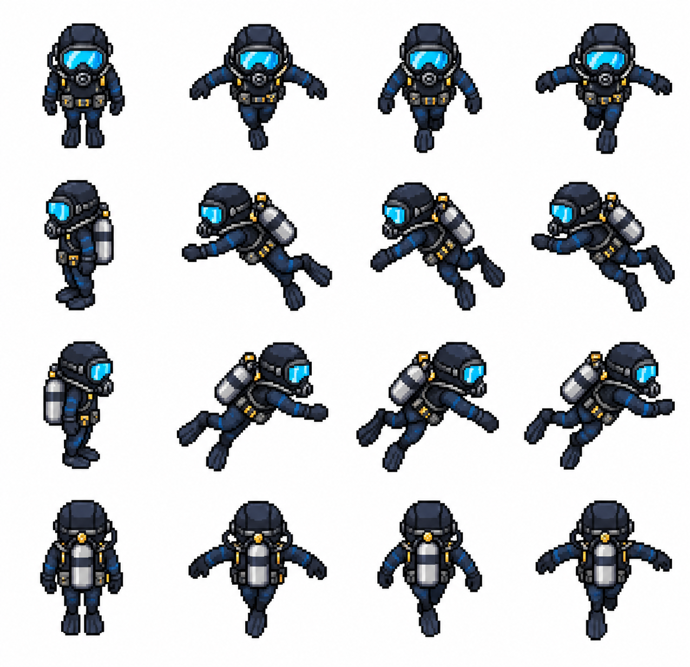
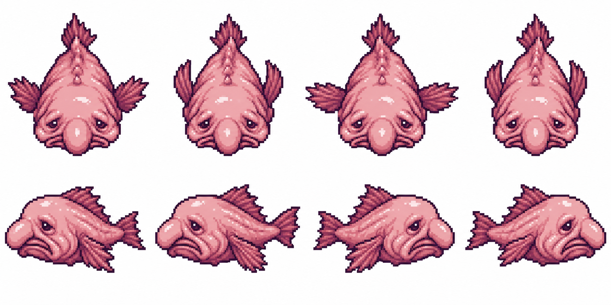

# PointNemo — frontend design handoff

> **Prepared asset update:** Use [`assets/prepared/runtime/manifest.json`](assets/prepared/runtime/manifest.json) and its accompanying PNG atlases for gameplay. The [prepared-assets guide](assets/prepared/README.md) includes transparent sprites, aligned anchors, animation sequences, independent water/buoy assets, and a browser preview. The source-art observations below describe the original generated sheets; sprite preparation has now been completed for the prototype bundle.

## Task and visual direction

Build the PointNemo frontend/PWA to visually match the three existing pixel-art assets listed below. These images are the visual reference for the interface, environment, character, and enemy treatment. Follow the team's chosen framework and gameplay requirements; this handoff specifies presentation and asset integration, not new game mechanics.

**Target feeling:** isolated in an endless ocean, deep-sea mystery, survival, and exploration. Use a 16-bit retro aesthetic with dark indigo water, slate-blue wave details, crisp pixel outlines, cyan equipment highlights, and a small red navigation signal. The pink blobfish supplies an organic accent against the cold ocean palette.

The frontend should feel like part of the same game world. Keep the ocean dominant and the interface compact, readable, and rectangular.

## Existing assets

Paths are relative to the repository root. Dimensions below were read from the actual PNG files.

| Asset | Source file | Actual dimensions | Intended use |
| --- | --- | --- | --- |
| Abyss ocean with red buoy | [`assets/maps/point-nemo-abyss-ocean.png`](assets/maps/point-nemo-abyss-ocean.png) | 1254 × 1254 | Ocean scene/background and visual reference |
| Ocean explorer | [`assets/characters/ocean-explorer-sprite-sheet.png`](assets/characters/ocean-explorer-sprite-sheet.png) | 1275 × 1233 | Player idle and swimming poses |
| Blobfish enemy | [`assets/enemies/blobfish-enemy-sprite-sheet.png`](assets/enemies/blobfish-enemy-sprite-sheet.png) | 1774 × 887 | Enemy overhead and profile poses |

### Ocean reference



### Player reference



### Enemy reference



Original generation prompts are saved beside each PNG as `.prompt.txt` files. Use them when requesting matching assets. These are generated source sheets; they still require preparation before use as animation atlases.

## Color system

The following are **suggested UI tokens derived visually from the assets**, not exact sampled palette values. Use the PNGs as the final visual reference.

| Token | Hex | Application |
| --- | --- | --- |
| Abyss | `#061426` | Page background and deepest water |
| Deep indigo | `#0B1E38` | Main interface panels |
| Ocean slate | `#193B5A` | Secondary surfaces and wave accents |
| Steel blue | `#426887` | Panel borders and quiet separators |
| Visor cyan | `#30D6F2` | Primary actions, focus, selected states |
| Signal red | `#FF4853` | Navigation markers, danger, urgent states |
| Blobfish pink | `#D98EAA` | Enemy-related accents and illustrations |
| Equipment gold | `#E6B957` | Small equipment or collectible accents |
| Main text | `#EAF4FC` | Headings and body text on dark surfaces |
| Muted text | `#A1B5CC` | Supporting text on dark surfaces |
| Outline | `#030912` | Strong sprite/UI edges and hard shadows |

Use cyan as the principal interactive accent. Reserve bright red for meaningful signals so it retains the buoy's visual importance. Keep pink and gold localized. Avoid large white UI surfaces; the sprite sheets' white is a source background to remove.

Check contrast for the final combinations: at least 4.5:1 for normal text, 3:1 for large text, and sufficient contrast for controls and focus indicators. Pair status colors with labels or icons.

## Interface styling

- **Shape:** rectangular panels, square corners, and optional small stepped corners. Use 2–3 px borders and 3–4 px hard offset shadows.
- **Spacing:** use a consistent 4 px spacing unit; common gaps are 8, 12, 16, and 24 px. Leave visible ocean around the HUD.
- **Surface:** opaque or nearly opaque dark-indigo panels, with restrained slate-blue details. Keep textures out of areas containing dense text.
- **Typography:** a locally bundled, licensed pixel display font can be used for short titles and counters. Use a readable monospace or sans-serif for instructions, menus, and longer text. Keep body copy around 16 px and avoid long all-caps paragraphs.
- **Icons:** use crisp pixel-style silhouettes with the same apparent pixel size and outline weight. Prefer simple compass, oxygen, settings, sound, and inventory shapes where those features exist.
- **Buttons:** dark fill, visible border, concise label, and a clear cyan focus/selection treatment. On press, shift by 1–2 px and shorten the hard shadow. Disabled states need a readable visual distinction.
- **Motion:** use discrete sprite frames and brief UI transitions. Keep the red beacon pulse slow and faint. Respect reduced-motion preferences and avoid rapid flashing.

Maintain the pixel-art treatment across menus, dialogs, HUD elements, empty states, and loading states. Avoid glass blur, soft floating-card shadows, glossy gradients, large pill buttons, and decorative emoji icons.

## Suggested screen composition

Adapt these layouts to the screens and features already agreed by the team.

### Entry or title screen

- Let the ocean occupy the full scene area, with the red buoy as a small point of interest.
- Place the title and a compact menu where they remain readable without covering the buoy.
- Use one clear cyan primary action and quieter secondary actions for existing features.
- Put important copy on a dark panel or solid backing instead of directly over detailed waves.

### Main game screen

- Use the ocean as the world layer and render prepared player/enemy sprites above it.
- Keep the explorer's cyan visor readable at the intended game scale.
- Anchor existing status indicators in a compact top HUD; place contextual controls along the bottom edge.
- Keep the center available for navigation, threats, and the buoy signal.
- Use an overhead enemy frame in the top-down world. Use profile frames in side-view scenes or previews if the game needs them.

### Menus and dialogs

- Use dark rectangular panels with a clear heading, generous text spacing, and a visible close/back control.
- Dim the scene behind modal dialogs and move keyboard focus into the active dialog.
- Reuse the same buttons and focus treatment across settings, pause, instructions, and any inventory screen.

### Mobile layout

- Fit the HUD and controls around the playable area in portrait and landscape orientations.
- Respect display safe areas and keep touch targets at least 44 × 44 CSS px, even when their visual icon is smaller.
- Support touch and keyboard input for relevant controls; give every icon-only button an accessible name.
- Avoid hover-only information. Keep menus scrollable when the viewport is short.

## Prepare the sprites before integration

### Player sheet layout

The source image visually contains **4 columns × 4 rows**:

| Row | Direction | Column 1 | Columns 2–4 |
| --- | --- | --- | --- |
| 1 | Down / toward viewer | Idle | Three swimming poses |
| 2 | Left | Idle | Three swimming poses |
| 3 | Right | Idle | Three swimming poses |
| 4 | Up / away from viewer | Idle | Three swimming poses |

### Blobfish sheet layout

The source image visually contains **4 columns × 2 rows**:

- Top row: four overhead swimming poses, facing down.
- Bottom row: two left-facing profile poses, followed by two right-facing profile poses.

### Required preparation

1. Preserve the original source PNGs and export processed versions separately.
2. Remove the solid white background from the character and enemy sheets. Preserve intentional light pixels inside the sprites; inspect goggles, tanks, eyes, and highlights. Use a controlled background selection rather than deleting every white pixel.
3. Identify each frame's actual bounds. **Do not assume a perfect equal-cell grid:** 1275 × 1233 does not divide evenly into 4 × 4, and 1774 × 887 does not divide evenly into 4 × 2. The artwork may also drift within the intended cells.
4. Export transparent individual frames or repack them into an atlas with explicit integer frame rectangles. Store frame bounds, direction, animation name, and anchor/pivot in metadata.
5. Normalize frame canvases and anchor positions so the character does not jump when a frame changes. Preserve consistent apparent body size and pixel scale.
6. Preview each loop at game size and adjust frame timing, alignment, or pose order as needed. A starting point of 6–8 frames per second can be tuned visually; the source poses are not verified seamless loops.
7. Choose the game's logical sprite size before final export. The source PNG dimensions are not the intended in-game sprite size. Inspect and clean up the pixel grid when reducing these generated images.

Proposed processed-output location: `assets/processed/characters/` and `assets/processed/enemies/`. These directories and processed assets have not yet been created.

## Ocean background and tiling

The current ocean PNG includes the red buoy and its glow baked into the image. Seamless edges were requested during generation but have **not been technically verified**.

- Use the complete image as a single bounded scene/background for the first implementation.
- For an endless world, first obtain a separate seamless water-only tile and a transparent buoy sprite. Repeating the current PNG would repeat the buoy too.
- Verify any proposed water tile in a 3 × 3 repeat preview to detect seams and obvious repetition.
- Keep the water layer, buoy, actors, effects, and HUD independently controllable once separate assets are available.

Suggested render order: water → buoy/world objects → characters and enemies → restrained effects → HUD and menus. Adjust actor/object depth ordering to the game's needs.

## Rendering and PWA integration

Keep the asset-generation tooling outside the browser bundle. The frontend consumes prepared image files; it does not need an OpenAI API key.

For DOM-rendered artwork:

```css
:root {
  --abyss: #061426;
  --panel: #0b1e38;
  --border: #426887;
  --accent: #30d6f2;
  --signal: #ff4853;
  --text: #eaf4fc;
  --text-muted: #a1b5cc;
  --outline: #030912;
}

.pixel-art {
  image-rendering: pixelated;
}

.game-panel {
  color: var(--text);
  background: var(--panel);
  border: 2px solid var(--border);
  box-shadow: 4px 4px 0 var(--outline);
}

.game-button:focus-visible {
  outline: 3px solid var(--accent);
  outline-offset: 3px;
}
```

For Canvas 2D, set `context.imageSmoothingEnabled = false`, including after canvas resizes that reset its state. For WebGL, use nearest-neighbor texture filtering. Draw atlas frames at integer coordinates and prefer integer scaling of the prepared logical art resolution. CSS pixelated rendering alone will not fix inconsistent pixel grids in a source image.

Maintain sprite aspect ratios. On smaller screens, adjust viewport/camera framing and HUD layout rather than stretching the game world. Account for device pixel ratio when setting canvas backing dimensions.

Preload required gameplay images before showing a playable scene. If offline play is part of the PWA, cache the app shell, local fonts, and approved runtime assets through the project's service worker. Version caches when assets change and test a reload without network access. Keep prompts and production metadata out of the runtime asset bundle unless needed.

## Acceptance checklist

- [ ] The frontend uses the dark indigo/slate-blue ocean palette and preserves cyan/red accent roles.
- [ ] Menus, buttons, HUD, and dialogs share consistent pixel-style edges and spacing.
- [ ] The explorer and blobfish match the supplied artwork, without redesigning their silhouettes or colors.
- [ ] White sprite-sheet backgrounds are absent from gameplay.
- [ ] Sprite frames are explicitly mapped, aligned, and previewed without clipping or visible position jumps.
- [ ] Sprites stay sharp and proportional at the chosen game scale.
- [ ] The ocean shows no unintended repeated buoys; any seamless-water claim has been visually checked.
- [ ] Text, controls, focus indicators, touch targets, and reduced-motion behavior are usable.
- [ ] HUD and menus work on narrow mobile screens and larger desktop screens.
- [ ] Required assets load reliably; offline behavior is verified if included in the PWA scope.

## Copyable implementation brief

> Build the PointNemo frontend to match the PNG references in `assets/maps`, `assets/characters`, and `assets/enemies`. Follow `FRONTEND_DESIGN_HANDOFF.md` for the suggested palette, compact pixel-style UI, sprite preparation, and responsive behavior. Preserve the dark ocean, cyan-visored explorer, red navigation buoy, and droopy pink blobfish visual identity. Integrate approved transparent sprites using explicit frame metadata. Use the existing ocean image as a single scene until a verified water-only tile is available. Follow the team's existing framework and feature scope.
