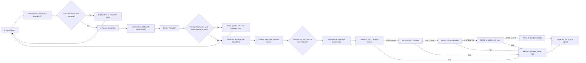

# Point Nemo — Hackathon MVP Web App Flow

**Audience:** Product, UX, frontend, backend, QA, and local AI teams
**Scope:** Strict single-device hackathon MVP, aligned to `point-nemo-masterplan.md`
**Product promise:** Turn one English text-based PDF into a source-grounded, replayable ocean descent using local processing and local storage.

## Implementation status

This document describes the five-module target journey. The standalone UI playground is a sample-data preview, not a replacement for the main React app. Main already includes local explorer login/signup and guest entry plus an integrated API with SQLite migrations; this PR preserves them. Remote authentication, connected profiles, and online leaderboards are not implemented here. Main currently groups its three encounters by difficulty; the topic-based WASD route below is an integration target, not a claim that this preview changes the authoritative backend. Preview instances are in memory only and reset on reload.

## MVP boundaries

- One learner on one laptop. Preserve the main app's local explorer login/signup and guest entry. Remote accounts, profile switching, and account recovery are outside this change.
- One PDF per document and generation run; learners may keep multiple independent document records in the local library. Never combine documents into one generated set. No cloud upload, cloud inference, cloud sync, or multi-device service.
- Runtime inference uses local Ollama with `qwen2.5:1.5b`. After setup and model download, the study flow works without internet access.
- Persist validated source material, generated questions, attempts, and run progression in local SQLite. The source PDF itself is handled in memory during extraction and is not retained by default.
- The only study experience in scope is a sequential, sprite-led descent route followed by its boss review. Standalone review or flashcard modes, leaderboards, and broad dashboard routing are deferred.
- Each accepted document and validated question set has an independent descent instance. Every attempt has its own run ID and saved position, answers, health, XP, and result; records from different documents are never combined.

## Product module map

The wider web app places a title screen and then a login/signup page before this experience. This flow and the UI playground start after those entry screens, at Module 1: Local Library. The playground does not implement or connect to the main app's local identity flow; it introduces no remote authentication.

| Module | Screens and responsibilities | Leads to |
| --- | --- | --- |
| **1. Local Library & Document Intake** | Upload and validate one PDF; show saved lessons and attempts; choose a lesson/sea and resume or start its own descent instance | Module 2 after a document is accepted; Module 3's sea selector after generation |
| **2. Sonar / Local AI Processing** | Show extraction, question generation, validation, bounded repair, and actionable failures | Module 1's Choose a Sea state after all 9 questions pass validation; Module 3 after the player chooses a lesson |
| **3. Ocean Descent** | Swim the lesson's three topic parts in sequence from Point Nemo; handle questions, HP, XP, and source-backed feedback | Module 4 after clearing all three parts; Module 5 after a failed part |
| **4. Lesson Boss Review** | Replay the same 9 questions in the saved shuffled order and check the 8/9 threshold | Module 5 on pass or fail |
| **5. Results & Saved Progress** | Show outcome, mistakes, retry, and resume state persisted locally in SQLite | Module 1 or resume the saved run |

These are learner-facing product modules. They describe screen ownership and transitions, not required source-code package boundaries.

## Additional playground previews outside MVP

The frontend playground also has standalone Profile and Leaderboard pages for visual review. They use sample data and are not part of the functional five-module MVP: Profile is a top-bar shortcut, and Leaderboard is an extra preview tab. Neither page implies authentication, cloud data, or an online leaderboard. The MVP exclusions above remain in force unless product scope is deliberately revised.

## Linear user journey

The diagram starts at the MVP entry point, after any wider-app login/signup page.

### 1. Library & Document Upload

The playground opens directly to a local library preview. In the main app, local login/signup or guest entry precedes the library. The primary action is **Upload PDF**; the library lists independent local document records, compatible saved question sets, active runs, and past attempts. Only one generation job may run at a time. After generation, the target **Choose your sea** state lists lessons whose question sets passed validation. The player selects a lesson card and either resumes that lesson's active run or starts a new descent instance for it; each card stays associated with its own document and map progress. This selection step stays in the same app tab so WASD control and local navigation remain predictable.

Current main accepts one English, text-based PDF per run with these admission rules:

| Admission rule | MVP limit |
| --- | --- |
| File count | One PDF per document and generation run; different PDFs remain isolated |
| File size | No upper admission limit |
| Pages | No upper admission limit |
| Extracted text | At least 300 extracted characters; no upper admission limit |
| Language/content | English text that can be extracted and tied to page-level source locations |
| Unsupported input | Scanned/image-only, encrypted, unreadable, empty, or out-of-limit PDF |

Validate before generation and show a specific, actionable reason when a file is rejected. Require usable text on each nonblank content page; figures and tables are not interpreted. Do not add OCR or silently truncate content. Keep uploaded PDF bytes in memory for extraction, then release them. Store normalized extracted pages and source passages needed for questions and feedback; do not retain the original PDF by default. A library record represents this saved extracted material and its generated data, not an archived copy of the uploaded file.

Uploading a PDF requests fresh generation. Reusing a saved question set is a separate, explicit action and is available only for the same document hash with compatible extraction, model, tokenizer, generation settings, prompt/schema, and game-rules versions. Label reused content **Saved questions** and show its creation time; never present it as fresh inference.

### 2. Local AI Processing (Sonar Loading)

After admission, show a real three-stage loading view. Each stage changes only when that work actually starts or completes; do not show a fabricated percentage. Include elapsed time, a cancel action, and a clear error/retry path.

| Visible state | Work performed | Completion condition |
| --- | --- | --- |
| **Extraction** | Parse the admitted PDF locally and retain page locations with normalized text | Text passes the character/content limits and source locations are available |
| **Generation** | Send only this document's extracted text and generation instructions to local Ollama using `qwen2.5:1.5b` | Model returns 3 distinct topics and 9 questions: one Easy, one Medium, and one Hard question per topic |
| **Validation** | Validate structure, exact count, topic/difficulty coverage, answer key, explanation, and source evidence | Exactly 9 questions pass checks; each has a defensible answer and an exact supporting PDF quote/page |

The final question set contains exactly 9 source-grounded questions: 3 distinct topics × 3 difficulty levels. A schema-valid response alone is not sufficient: reject unsupported claims, missing/incorrect quotes, ambiguous answer keys, duplicates, or malformed questions. Allow at most one bounded model repair attempt per job using validation feedback. If that fails, offer **Retry generation** as an explicit user action using the saved extracted text; each retry starts a new job with the same limits, and retries are never automatic. Extraction failures require the learner to select the PDF again. A cancelled job cannot commit later. If validation still fails, report the failure and return the learner to the library without starting a run.

All nine questions are generated and validated before a run starts. Do not call the model during combat; question order and feedback evidence come from the saved question set.

### 3. The Ocean Descent (Game Phase)

Each validated document/question set creates its own descent instance and its own map/player/run state. The player starts at Point Nemo, moves around the top-down ocean map with **W, A, S, D**, and reaches four enemy markers in sequence: three lesson-part encounters and that lesson's final boss. Only the next marker can trigger an encounter; later markers remain locked until the current part is cleared. Completing a part unlocks the next target. The player can close the app and resume the same run at its saved map position and route stage.

Group the nine validated questions by their three generated topics: each part contains that topic's Easy, Medium, and Hard questions. This keeps exactly three questions per topic and uses all nine questions once before the boss. Each part starts with **100 player HP**, **100 encounter HP**, and combo 0. The player answers all three questions in a part before its 2/3 pass check is resolved, even if an HP bar reaches zero partway through. A passed part unlocks the next route stop; a failed part ends the run.

| Sequential route stop | Lesson content / sprite role | Difficulty and questions | Player HP at start | Encounter HP at start | Pass condition |
| --- | --- | --- | ---: | ---: | --- |
| Point Nemo | Starting buoy and diver spawn | No questions | — | — | Swim to Part 1 |
| Part 1 · Topic 1 | First lesson section and route landmark | Easy, Medium, Hard · 3 questions | 100 | 100 | At least 2/3 correct |
| Part 2 · Topic 2 | Second lesson section and route landmark | Easy, Medium, Hard · 3 questions | 100 | 100 | At least 2/3 correct |
| Part 3 · Topic 3 | Third lesson section and route landmark | Easy, Medium, Hard · 3 questions | 100 | 100 | At least 2/3 correct |
| Lesson boss | Final battle at the end of this lesson's route | Mixed review · same 9 questions | 100 | 80 | At least 8/9 correct |

Resolve each answer immediately, then let the player continue to the next question:

| Answer | Encounter effect | Feedback shown |
| --- | --- | --- |
| Correct in a lesson part | Deal 50 damage to the enemy and award 10 XP | Mark correct and show a concise explanation with its source |
| Incorrect | Deal 50 damage to the player | Immediately reveal the correct answer, explanation, and exact supporting PDF quote with page number |

Present every question in the fixed part. At the end of its three answers, unlock the next route part if the player met the threshold; otherwise end the run and open Results. On a passed part, reset player and encounter HP to 100 and combo to 0 for the next part while preserving run XP and attempts. Keep the question, answer, feedback, and source passage connected so the player can inspect why an answer was correct.

### 4. The Lesson Boss Review

After the player clears all three topic parts, start the final boss encounter at the end of that lesson's route. This is labeled **Mixed-topic review: previously encountered questions**. It contains the exact same 9 questions from the descent, shuffled into a saved order; it does not generate new questions.

| Boss | Questions | Player HP at start | Enemy HP at start | Correct answer | Pass condition |
| --- | --- | ---: | ---: | --- | --- |
| Lesson boss | All 9 descent questions exactly once, 3 per topic, in a saved shuffled order | 100 | 80 | Deal 10 enemy damage and award 10 XP | At least 8/9 correct; 7/9 or fewer fails |

#### Route art and sprite use

Use `assets/maps/point-nemo-abyss-ocean.png` as the main world area. The player artwork originates in `assets/characters/ocean-explorer-sprite-sheet.png`; render its prepared transparent Explorer atlas using the manifest's directional idle/swim sequences and shared anchors. Use the prepared runtime creature atlases in `assets/prepared/runtime/`, with frame names and shared anchors from `manifest.json` and the helpers in `src/assets/sprites.js`, as overworld enemy markers. The player moves freely within map bounds, while encounter triggers enforce the fixed lesson order. `water.png` with its mirrored repeat mode remains available for other scene backgrounds. Keep pixel edges crisp and preserve each prepared atlas species' scale and anchor across animations.

The current prepared runtime art does not include Clownfish, Giant Squid, or Megalodon. Do not imply those creatures have dedicated sprites. Use a clearly identified existing prototype sprite for a placeholder encounter, or add approved art before claiming that the named enemy is represented. Use `effects.png` for sonar cast/hit and hull-hit feedback. Source concept sheets with white backgrounds are not runtime assets.

The boss stage starts with 100 player HP and combo 0. A wrong answer deals 50 player damage, resets combo, and reveals the correct answer, explanation, and exact quote/page. Present all nine questions before resolving the result, even if an HP bar reaches zero. Boss correct answers deal 10 enemy damage and award 10 XP; these are practice repeats and do not create new questions or additional unique-topic mastery. Keep the shuffled order with the run so refresh/resume continues the same encounter.

### 5. Results & Saved Progress

On a boss pass, award a **Descent Complete** badge tied to that run. The badge records completion; it is not a certification or a claim of mastery. Results show the three topic-part scores and boss score; the nine unique questions versus eighteen total answer slots; missed topics; and the source-backed mistakes for review.

Failing any lesson part or the boss ends the run. Results show the failed threshold, mistakes, correct answers, explanations, and exact PDF quotes. **Try again** starts a new run instance from the same validated question set with XP reset to zero; keep the failed run in attempt history.

Save each run and route progression locally in SQLite, including the document/question-set association, a unique run/instance ID, map ID, run status, current topic stop, player map coordinates and facing direction, question order, current slot, HP, combo, XP, accepted answers, feedback, and results. On reopening the app, offer **Resume run** for that lesson's active instance and restore its saved route position and order, provided its game-rules version is still supported. An identical answer retry returns the original feedback and state without applying damage or XP again; changed answers and out-of-order submissions are rejected. **Try again** creates a separate run instance from the same compatible validated set with XP reset to zero; prior attempts remain in history. Completed and failed attempts remain in the local library until the learner deletes that document. Deleting a document cancels related work and transactionally removes its extracted material, question sets, runs, attempts, progress, and run-tied badges; an active run closes. This is same-device persistence; it does not imply cloud backup or cross-device recovery.

## MVP screen inventory

| Module / screen state | Required content and actions |
| --- | --- |
| **Module 1 · Local library** | Upload PDF; show admission limits; list saved materials/question sets, active run, and attempt history; resume or retry |
| **Module 1 · Choose a sea** | List validated lesson records; show each lesson's active instance; resume that run or create a separate new descent instance |
| **Module 2 · Sonar loading** | Actual Extraction → Generation → Validation states, elapsed time, cancel, and specific failure/retry feedback |
| **Module 3 · Descent route and topic part** | Point Nemo start, sequential topic stops, player position, route progress, difficulty/questions, HP, XP, accessible answers, and answer resolution |
| **Module 3 · Answer feedback** | Correctness; for a miss, correct answer, explanation, exact quote, and PDF page; Continue action |
| **Module 4 · Boss review** | Final lesson boss, mixed-topic label, saved shuffled nine-question order, score toward 8/9 |
| **Module 5 · Results** | Pass/fail, badge if earned, stage/boss scores, mistakes and sources, retry, library, and resume when applicable |

## Local-first behavior and handoff boundaries

- The browser calls the local application API; it does not call Ollama directly. The local API coordinates PDF extraction, Ollama generation, validation, scoring, and SQLite transactions.
- Runtime AI inference and application data stay on the device. Internet access is needed only to install prerequisites and download the model before offline use.
- If Ollama is stopped, show a useful local-service error and preserve the admitted library/run state. If the app closes mid-run, restore the selected lesson's saved run and map position instead of creating a new one.
- Make keyboard focus, answer labels, contrast, reduced-motion support, and visible state changes part of each encounter/loading/result screen.
- Provide local deletion for a document and its associated question set, runs, attempts, progress, and badges. Cancel related work and delete linked records transactionally.
- Do not add remote user accounts, cloud sync, standalone review or flashcards, connected leaderboards, broad dashboard quick-access routing, arbitrary file formats, or OCR in this change. Main's existing local identity flow and current PDF admission behavior remain intact.

## Team ownership

| Team | MVP responsibility |
| --- | --- |
| Product / UX | Five-module flow, sea selection, admission/loading/error copy, answer feedback, run recovery, and results |
| Frontend | Local library and sea selection, PDF selection, Sonar states, isolated top-down map instances, WASD movement, linear encounter triggers, boss encounter, results, resume |
| Backend | Loopback API, upload admission, run state, scoring, SQLite persistence and transactions |
| Document processing | Bounded PDF extraction, normalized text, page-level source passages, rejection reasons |
| Local AI | Ollama model configuration, question generation, bounded repair, structural and source validation |
| QA | Admission edge cases, question/source correctness, scoring thresholds, close/resume, offline runtime evidence |

Use `point-nemo-masterplan.md` for implementation gates, detailed data contracts, build sequence, and hackathon acceptance evidence. This document defines the learner-facing MVP flow; a described behavior is a target until implementation and acceptance evidence confirm it.
