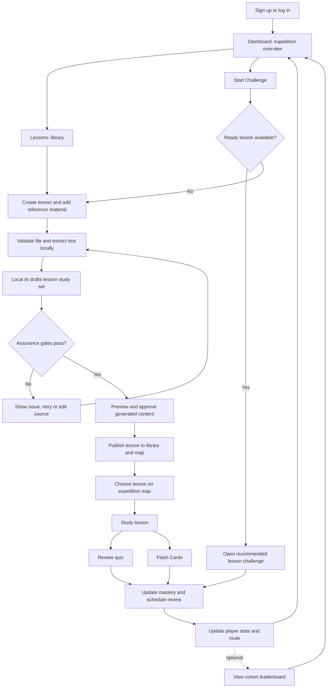

# PointNemo Web App — Product Flow Handoff

**Audience:** Product, UX/UI, frontend, backend, and local AI teams  
**Status:** Proposed end-to-end product flow; current implementation status is at the end  
**Product principle:** A learner adds trusted course material, PointNemo turns it into source-grounded study activities locally, and progress through those activities advances an undersea expedition.

## 1. Product decisions for the first release

- PointNemo is a local-first study app. Learner material is stored on the device and sent only to the configured local Ollama service for AI processing. Do not imply cloud backup or cross-device sync.
- The experience starts with **Sign up** or **Log in**. For the first local release, these actions create or select a device-local learner profile. Do not collect email/password or promise account recovery until a hosted identity provider is chosen.
- A lesson is the central unit of work. A lesson groups its source materials, extracted content, generated study set, map destination, learning activity history, and mastery progress.
- AI output stays a draft until it passes validation and the learner approves it. A passing JSON schema alone does not establish factual accuracy.
- Lessons are selectable from the map when they are ready. Course order can suggest a route; it does not block a learner from choosing another ready lesson by default.

## 2. Primary navigation

| Destination | Purpose | Main action |
| --- | --- | --- |
| Dashboard (Home) | Resume the expedition and surface the next useful study action | Start Challenge, continue a lesson, or review due cards |
| Lessons | Lesson library and source-material workspace | Create a lesson, import material, inspect AI processing, open a lesson |
| Map | Choose a ready lesson and see expedition progress | Open a lesson node |
| Review | Recall practice across lessons, starting with due or missed material | Start a short review session |
| Flash Cards | Focused card-by-card practice | Reveal, rate recall, and schedule the next review |
| Stats | See learning progress as expedition/player attributes and compare within a cohort | Inspect mastery, consistency, route progress, or leaderboard |

Keep the same destinations on desktop and mobile. On narrow screens, use a compact bottom navigation for Dashboard, Lessons, Map, Review, and Stats; place Flash Cards inside Review or expose it as a clear mode selector there. Account/profile and settings remain accessible from the header.

## 3. End-to-end learner journey



### Step 1 — Sign up or log in

1. Show **Create profile** and **Log in** entry points.
2. For the local release, create a device-local profile with a display name and optional avatar. Logging in selects an existing profile on that device; profile unlock protection can be added without making it a cloud account.
3. Explain that the profile and study data live on this device. Provide a clear profile switch and local data export/delete controls in settings.
4. After profile selection, open the Dashboard. A new profile enters the empty state with one action: **Create your first lesson**.

### Dashboard — quick access and Start Challenge

The Dashboard is the default landing page after login and the return point after study sessions. It answers three questions immediately: what can I continue, what is ready to practice, and what is my next expedition step?

Show these quick-access items near the top:

- **Continue lesson:** reopen the last active lesson at its saved position.
- **Review due:** start a short Review session from due or previously missed questions.
- **Flash Cards due:** open the due-card queue.
- **Add material:** open the Lessons library with the import action ready.
- **Open map:** browse ready lessons and route progress.

Feature one **Next expedition** card with the recommended ready lesson, its mastery/readiness, and a prominent **Start Challenge** button. Start Challenge launches a short, lesson-specific challenge session and follows this routing:

1. If a last-active lesson is ready, open its challenge directly.
2. Otherwise, if ready lessons exist, show a compact lesson picker with the recommended lesson selected; choosing a lesson opens its challenge.
3. If no lesson is ready, open Lessons and start the first-material flow. Explain that a lesson becomes challengeable after its study set passes the assurance gates and is approved.

The challenge uses approved lesson questions, gives answer feedback with source references, and updates attempts/mastery on completion. Offer **Continue lesson**, **Try another challenge**, and **Return to Dashboard** on the result view. Do not send a learner into a failed/in-progress generation job from this button.

### Step 2 — Lessons library

Lessons is both the course library and the place to manage source materials. Organize it as:

```text
Library
  Subject / course
    Lesson
      Reference materials
      Extracted source text
      Generated study set
      Learning activity and mastery
```

Each lesson card shows its title, subject, material count, processing/readiness state, mastery, and next action. The lesson detail page has these sections:

- **Overview:** learning goals, estimated duration, readiness, and progress.
- **Materials:** imported files, extraction state, source locations, and remove/replace actions.
- **Study set:** AI-generated notes, key concepts, questions, and flash cards. Each generated item links back to its source material or excerpt when available.
- **Practice:** launch Review or Flash Cards for this lesson.
- **Progress:** attempts, topics to revisit, and mastery history.

Creating a lesson requires a title and subject. The learner can add one or more supported files, or create the lesson shell first and import material later. Keep the original source file locally and show its filename, type, and import date.

### Step 3 — Import and process materials

1. The learner chooses a file from the device and assigns it to a lesson.
2. Validate file type and size before processing. The first supported formats are PDF, DOCX, and PPTX; the UI lists accepted formats and explains any import failure in plain language.
3. Store the file locally, extract text locally, and retain page/slide/section locations where the parser provides them.
4. Show a processing timeline: **File checked → Text extracted → Source reviewed → Study set drafted → Assurance checks → Ready for review**.
5. Run the configured Ollama model against extracted lesson content only. Show the selected model, progress, and cancellation action. An unavailable model does not block the rest of the app; explain how to restart processing after Ollama is available.

### Step 4 — Local AI assurance gate

The AI pipeline creates draft notes, key concepts, review questions, and flash cards. Content remains unpublished until every required gate passes:

| Gate | Requirement | Failure behavior |
| --- | --- | --- |
| File gate | Allowed type, size within configured limit, readable file | Reject the file and explain the allowed formats or recovery step |
| Extraction gate | Nonempty extracted text with usable source locations where possible | Keep the original file, mark extraction failed, let the learner retry or replace it |
| Scope gate | Prompt contains only this lesson's extracted material and generation instructions | Stop the job; do not include other lessons or hidden app data |
| Structure gate | Generated response matches shared schemas; answer indexes and card fields are valid | Reject malformed output and allow a bounded retry |
| Source gate | Each factual item has a source excerpt or location, or is clearly marked as an unsupported draft | Hold unsupported items for edit/removal; do not label them source-grounded |
| Quality gate | Questions have one defensible answer, plausible distractors, readable wording, and no duplicates | Flag questionable items for learner review; allow edit, regenerate, or delete |
| Approval gate | Learner previews and approves the study set | Keep it in draft; do not expose it to the map or review queue |

Never silently repair generated facts. Keep generation metadata and validation results with the draft. The learner can edit, remove, or regenerate individual items. A failed job must preserve already-imported material and explain whether retrying may replace or duplicate a draft.

### Step 5 — Publish the lesson

After approval, publish the lesson as **Ready**. Create or unlock its map destination and make its approved study set available to Study, Review, and Flash Cards. The learner may return to Materials to add another file; changed source content creates a new draft version and does not silently replace an approved study set.

Lesson states:

| State | Meaning | Available actions |
| --- | --- | --- |
| Empty | Lesson has no source material | Add material or edit lesson details |
| Importing | File validation or extraction is running | Cancel, view progress |
| Needs attention | Import, extraction, model, or assurance gate failed | Read issue, retry, replace source, or edit draft |
| Draft ready | Generated set passed automatic gates but awaits learner review | Preview, edit, remove, approve |
| Ready | Learner approved the study set | Study, open map node, review, flash cards |
| Updating | New source material or generation version is being prepared | Continue using the last approved set; inspect the new draft |

### Step 6 — Map and lesson study

The Map presents one node per ready lesson, grouped by course/subject and colored by progress. A learner selects a node to see its goals, estimated time, mastery, and **Start lesson** action. The first release allows choosing any ready lesson; use visual route suggestions for course order rather than hard locks.

Opening a lesson enters Study mode:

1. Show the learning goal and concise source-grounded lesson notes.
2. Let the learner expand concept explanations and open their source excerpts.
3. Offer **Review this lesson**, **Study flash cards**, and **Return to map** at clear stopping points.
4. Save activity progress locally so leaving and returning does not lose the lesson position.

The expedition theme frames progress and feedback. It must not obscure the source material, answer feedback, or navigation.

### Step 7 — Review mode

Review is a short question session across one lesson or the whole library. Default to due review items and concepts previously missed; let the learner choose a lesson and session length. After each answer, show correctness, a concise explanation, and the linked source excerpt. At the end, show score, concepts to revisit, and a one-click route to those flash cards or lesson sections.

Record each attempt with question/card ID, selected answer or recall rating, correctness, lesson ID, and timestamp. Do not count opening a card as mastery.

### Step 8 — Flash Cards mode

Flash Cards supports a lesson-specific session and a due-card queue across lessons:

1. Show one prompt at a time.
2. Let the learner reveal the answer and source reference.
3. Ask the learner to rate recall (for example: **Again**, **Hard**, **Good**, **Easy**).
4. Schedule the next review from that rating and prior attempts.
5. End with cards due again, cards learned for now, and a route back to the lesson.

Cards stay linked to the source material. Editing a source or card creates a revised item; preserve prior attempts for history and recalculate future scheduling only for the revised card.

### Step 9 — Player stats and progress

Stats translate real learning signals into the expedition theme. Use explicit labels so learners understand what each number measures.

| Player-facing stat | Actual measure |
| --- | --- |
| Expedition depth | Number of approved lessons studied, with current lesson shown separately |
| Knowledge / mastery | Per-lesson performance across recent review attempts, weighted toward repeated recall |
| Current / best streak | Consecutive study days using a defined local calendar rule |
| Recall readiness | Due flash cards completed and cards currently due |
| Route progress | Ready, in-progress, and completed lesson nodes |
| Study consistency | Active study sessions or days over a selected period |

Avoid presenting generated content volume or time-on-screen as knowledge. Show the calculation window and provide a route to the underlying lessons and attempts. Keep streaks encouraging; do not punish missed days.

### Leaderboard

Leaderboard is a tab inside Stats, alongside **My Stats**. It compares learners who explicitly join the same class or expedition cohort. Participation is opt-in, uses a learner-chosen display name/avatar, and can be ended at any time. Never expose source files, lesson titles, answer history, or detailed study activity to other learners.

Rank by **weekly mastery points**, not hours online or raw answer volume:

- Award points for distinct concepts that reach mastered status after repeated correct recall.
- Award a one-time lesson milestone when the learner completes an approved lesson's study and review steps.
- Cap points per concept and lesson each week so repeated attempts cannot be farmed.
- Start a new weekly board on a consistent cohort timezone; retain personal history in My Stats.
- Break ties with mastery improvement, then share the rank if still tied.

The board shows rank, display name/avatar, weekly points, and a broad expedition level. Show the scoring rules and board reset time. Ask before joining and keep a **Leave leaderboard** control available. Do not shame low ranks or make participation necessary to unlock lessons or rewards.

Cross-device cohorts require an identity and sync service that the current local-first app does not have. Until it exists, keep the leaderboard entry unavailable or label any on-device profile comparison as local-only; never imply it represents a class or global ranking.

## 4. Required global states and behaviors

- **No API/Ollama:** Dashboard, saved lessons, and previously approved study sets remain usable. Disable only actions that require the unavailable service and provide a recovery message.
- **No lessons:** Dashboard and Map guide the learner to create a lesson.
- **No approved content:** Show draft/processing state and withhold the lesson from study modes and the ready map.
- **Offline:** Local library, approved study sets, and saved progress remain available. Queue no hidden external requests.
- **Reduced motion / keyboard:** All study actions work without animation. Every control has focus visibility, a label, and a keyboard path.
- **Data lifecycle:** Explain local storage, export, deletion, and the fact that reinstall/device loss may remove data unless the learner exports it.
- **Leaderboard privacy:** Hide the leaderboard until a cohort service is available; joining and leaving are explicit, and shared fields are limited to the display name/avatar and aggregate weekly score.

## 5. Team boundaries and data ownership

| Team | Owns |
| --- | --- |
| Product / UX | Navigation, learner states, empty/error/recovery copy, approval interaction, mastery definitions |
| Frontend | Navigation shell and Dashboard quick access, library and lesson views, map, Study/Review/Flash Cards/Stats, progress and accessibility states |
| Backend | Local profile ownership, SQLite migrations/repositories, file lifecycle, processing job state, validated APIs |
| Document processing | PDF/DOCX/PPTX validation and extraction, source locations, extraction errors |
| Local AI | Ollama configuration, prompts, bounded generation/retry, schema validation, provenance and assurance results |
| Cohort / sync | Opt-in membership, privacy controls, weekly score aggregation, rank snapshots, and board reset timing |

The browser should not call Ollama directly. The API coordinates local extraction, AI generation, validation, and SQLite writes. Keep raw file bytes, extracted text, generated drafts, approved study sets, attempts, and progress as distinct lifecycle records.

## 6. Suggested domain records

The existing project already defines subjects, topics, study materials, questions, attempts, and progress. The full flow also needs:

- **LocalProfile:** profile ID, display name, optional avatar, created/last-used timestamps.
- **Lesson:** topic/course link, title, learning goals, status, current approved version.
- **Material:** original filename, local storage reference, MIME/type, checksum, import status, extracted text, source-location metadata.
- **ProcessingJob:** lesson/material/version, current stage, model ID, timestamps, cancel/failure reason, assurance results.
- **StudySetVersion:** generated notes, concepts, questions, cards, provenance, validation status, approval timestamp.
- **FlashCardSchedule:** card ID, recall rating, due timestamp, interval/ease data.
- **Attempt / Session:** activity type, lesson, item, response/rating, correctness, timestamp, session duration if needed.
- **CohortMembership / WeeklyScore:** cohort ID, profile ID, opt-in state, weekly mastery points, score period, and rank snapshot. Store only fields needed for the board; keep attempt-level data local/private.
- **Progress:** lesson status and mastery summary derived from attempts, with a path to the underlying evidence.

Treat mastery summaries and player stats as derived values. Attempts and approved content are the durable source records.

In the current schema, `topics` is the closest match to a lesson. Extend that concept or migrate it deliberately; do not create separate topic and lesson records with overlapping ownership. Add profile ownership to lesson, material, attempt, and progress records before supporting multiple local profiles.

## 7. Delivery sequence

1. **App shell and local profile:** navigation, create/select profile, Dashboard quick access and empty state, local data ownership.
2. **Lessons library:** subjects, lesson create/edit, material list, local file selection, format/size validation.
3. **Processing pipeline:** extraction stages, cancellation/retry, visible progress, source locations.
4. **AI assurance:** local Ollama draft generation, schema and provenance checks, review/edit/approve gate.
5. **Lesson and Map:** publish approved lesson nodes, choose lesson, source-grounded Study view.
6. **Practice:** Review questions, answer feedback, Flash Cards, due scheduling, attempt history.
7. **Stats:** mastery and expedition metrics derived from stored attempts; accessible visual presentation.
8. **Leaderboard:** after identity and sync are available, add cohort opt-in, privacy controls, weekly score aggregation, and rank snapshots.
9. **Hardening:** local export/delete, data migration, offline/recovery behavior, narrow-screen and reduced-motion review.

Each step should leave the app usable. Missing Ollama or a failed import must not prevent the learner from opening previously approved lessons.

## 8. Current implementation versus target

The repository currently has a React/Vite web shell, illustrative expedition map, turn-based encounter, battle VFX, Express health and AI-status endpoints, SQLite initialization, shared Zod schemas, and Ollama/document-extraction service boundaries. It does not yet have the product Dashboard or its Start Challenge routing.

The following target-flow features are **not implemented yet**: sign-up/log-in profiles, Dashboard quick access and Start Challenge routing, file upload and extraction, lesson library CRUD, AI study-set generation endpoint, approval/versioning UI, map nodes linked to stored lessons, Study mode, Review mode, Flash Cards scheduling, persisted player stats, cohort identity/sync, and leaderboard scoring. Existing database tables are a starting point; they do not yet cover profile ownership, processing jobs, study-set versions, card schedules, or cohort scores.

Use this document as the product journey and handoff boundary. Use the API/shared schemas and existing design documents for implementation details; update this flow when product decisions or supported formats change.
