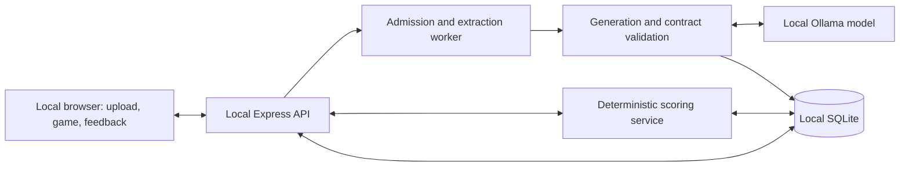
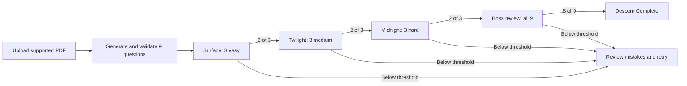

# Point Nemo: The Full Masterplan

**Revision 3 — October 10, 2026 — Asia/Manila (UTC+8).** This revision records the first P0 backend and document-intake implementation pass. It defines implementation contracts, acceptance gates, and submission work. Runtime acceptance, benchmarks, registration, and submission remain pending; implementation checks below are not a substitute for offline release evidence.

**Document authority:** this masterplan is the current product and hackathon source of truth. It supersedes the earlier [project setup design](<C:/Users/Mark Vasquez/Documents/Point nemo/docs/superpowers/specs/2026-10-09-point-nemo-design.md>) wherever they conflict, especially its deferred upload/generation flow, DOCX/PPTX scope, browser-only sample state, and route direction. The setup design remains a historical record of the first scaffold proposal.

## 1. Product goal and MVP boundary

Point Nemo turns a student's short, text-based PDF notes into an ocean-themed study game on their own laptop. The student uploads an excerpt, receives questions tied to its source text, answers through three depth zones, and completes a mixed-topic boss review. Feedback explains each answer and shows its supporting passage. Saved progress lets the student resume offline after setup.

**Product hypothesis:** short question-and-feedback sessions may make students more willing to practise. The prototype does not establish improved long-term retention or subject mastery. A completion badge records performance in this game, including repeated questions.

| Included in the hackathon MVP | Deferred |
| --- | --- |
| One user, one laptop, English text-based PDFs within section 5 limits | Accounts, multiplayer, remote/LAN inference, mobile installation, cloud inference |
| Three topics, nine generated questions, three depth zones, one boss review | Flashcards, summary reviewers, spaced repetition, arbitrary-length documents |
| Source passages, feedback, deterministic scoring, saved attempts, resume and document deletion | OCR, scanned/handwritten notes, DOCX, chat, vector database |
| Setup instructions, honest loading/errors, offline proof, recorded and live demos | Extra bosses, 3D graphics, elaborate animation, additional achievements |

These exclusions are product decisions. The merged guide does not prescribe flashcards or summary reviewers.

**Submission-description draft:** “Point Nemo turns short PDF notes into an ocean study adventure, with locally generated questions, source-linked explanations, and progress saved on the student's laptop.” Publish this as working behavior only after the corresponding acceptance gates pass.

### Current phase — P0/P1 Authoritative game run backend and connected web interface

Batch 1 and Batch 2 are complete: PDF admission, strict Ollama schema, document jobs, question sets, and web intake.
Phase 1, 2, and 3 are complete:
- Authoritative run engine (`POST /api/runs`, `GET /api/runs/:id`, `POST /api/runs/:id/answers`) with 18 fixed slots, stage boundaries (Surface, Twilight, Midnight 2/3 pass; Boss 8/9 pass, 7/9 fail), transactional persistence, question masking, and identical-retry idempotence.
- 14 automated backend unit and route integration tests verifying the full lifecycle and integrity constraints.
- Connected web interface allowing students to start runs, answer questions, inspect source evidence quotes, track live HP/XP/combo stats, and resume runs across page reloads.

The next required step is release acceptance on the demo laptop: run the real configured Ollama model, repeat the flow with external networking disabled, manually review all nine answers and evidence quotes, and record runtime benchmarks before calling the full MVP complete. The current code does not claim that A3–A8 have passed.

### Hackathon critical path

Do work in this order and stop lower-priority work whenever a higher tier is not demonstrably working:

| Priority | Required outcome |
| --- | --- |
| **P0 — submission blocker** | Confirm rules/team; public reproducible repository; one supported PDF produces a valid source-grounded set through local Ollama; a complete simple win/loss game works; offline proof, README, disclosure, video/posts, and submission evidence exist |
| **P1 — reliability** | Saved runs, idempotent answers, clear invalid-input/model errors, cancellation, document deletion, second-document isolation, and measured cold/warm performance |
| **P2 — presentation** | Ocean polish, extra transitions, richer library/history views, and nonessential animation |

The full contracts below describe the intended finished MVP. If time forces a cut, remove P2 first and disclose any missing P1 behavior. Never cut P0, source fidelity, truthful labels, or required submission work. A limitation must be visible in the README and demo; an unimplemented feature must not be described as working.

## 2. Event references and rules to confirm

Use the [merged guide](<C:/Users/Mark Vasquez/Documents/Point nemo/merged_hackathon_guide.md:1>) as the supplied requirements reference, with the corrections below. Preserve that source; this section records which statements govern this plan.

| Topic | Planning decision and source status |
| --- | --- |
| Dates | **Verified correction:** build day is October 9, 2026, kickoff 1:00 PM; demo day is October 10, 2026, 1:00–7:00 PM at Cyberzone, SM Makati. The guide's October 29–30 dates are superseded for this plan. [Organizer listing](https://cerebralvalley.ai/e/appbuildersph-hackathon-2026) |
| Cutoff | **Pending confirmation:** the [guide](<C:/Users/Mark Vasquez/Documents/Point nemo/merged_hackathon_guide.md:18>) specifies 10:00 AM and suggests 9:30 AM. Plan against October 10 at 10:00 AM, target submission by 9:30 AM, and obey an earlier organizer-confirmed cutoff if supplied. The accessible listing does not confirm the exact deadline. |
| Local AI | Follow the [core local-computation rule](<C:/Users/Mark Vasquez/Documents/Point nemo/merged_hackathon_guide.md:43>). No runtime cloud dependency or cloud fallback. The [weak-hardware tip](<C:/Users/Mark Vasquez/Documents/Point nemo/merged_hackathon_guide.md:69>) is not used as an exemption. |
| Social posts | The [guide](<C:/Users/Mark Vasquez/Documents/Point nemo/merged_hackathon_guide.md:22>) says X or LinkedIn with Cognition and `#AppbuildersPH`; the [listing](https://cerebralvalley.ai/e/appbuildersph-hackathon-2026) requests both platforms and Cognition/Devin tags. Delivery owner confirms requirements. Prepare for both channels and combined tags; verify handles before publishing. |
| Original work | The [guide](<C:/Users/Mark Vasquez/Documents/Point nemo/merged_hackathon_guide.md:51>) permits disclosed existing code; the [listing](https://cerebralvalley.ai/e/appbuildersph-hackathon-2026) uses stricter build-during-event wording. Build the app during the event, disclose dependencies/tools and these planning documents, and confirm any pre-existing-app exception before relying on it. |
| Detailed rules | The Local AI rubric, exact disqualification conditions, 5+3-minute pitch format, and detailed prizes remain guide-derived. Direct organizer-page access was blocked during review. Record clarification in the evidence log; do not present these details as independently verified. |

## 3. Ownership and delivery responsibilities

**The project owner is accountable for every role until a named registered teammate accepts it.** These are roles, not additional team members; one person may hold all roles. Actual names, final team name, roster, and onsite availability must be recorded before A1 passes. Do not infer them from this workspace.

| Role | Responsibility | First deliverable |
| --- | --- | --- |
| Delivery owner | Rules, roster of 1–4, repo visibility, provenance, deadlines, submission receipt | Evidence log with confirmed rules and assigned names |
| AI/backend owner | Local setup, extraction, generation, validation, API/DB, errors | Fresh local question set from the fixture |
| Game/UI owner | Upload, loading, combat, feedback, results, resume/delete | Complete deterministic descent using a test set |
| QA/demo owner | Fixtures, answer review, offline proof, measurements, README verification, recording/pitch | Acceptance record and demo assets |

Delivery verifies the [registered-member/no-external-help rule](<C:/Users/Mark Vasquez/Documents/Point nemo/merged_hackathon_guide.md:13>) and distinguishes registered human contributions from disclosed AI coding tools allowed by the [guide](<C:/Users/Mark Vasquez/Documents/Point nemo/merged_hackathon_guide.md:52>).

## 4. Local runtime, stack, and privacy boundary

**Deployment:** a locally installed web app. Express serves the built frontend/API at `http://127.0.0.1:3000`; only Express communicates with Ollama at `http://127.0.0.1:11434` and local SQLite. Vite is for development/build. Demo startup uses the built app with all images, fonts, styles, and scripts stored locally.

| Layer | Choice |
| --- | --- |
| Runtime | Node.js **24.21.0** initial pinned baseline, listed as LTS when reviewed. Verify dependency compatibility during bootstrap. [Node releases](https://nodejs.org/en/about/previous-releases) |
| Frontend | React, Vite, Tailwind CSS, Zustand; TypeScript |
| Backend | Express, Multer memory uploads, `pdf-parse`, Zod; TypeScript |
| Storage | SQLite via `better-sqlite3`, backend only |
| AI | Ollama with **`qwen2.5:1.5b`** initially; listed quantization Q4_K_M. Record actual installed digest. This is a starting choice, not a quality/speed guarantee. [Model reference](https://ollama.com/library/qwen2.5:1.5b) |
| Prompt budgeting | Model-matched tokenizer with local assets; choose/pin a Node-compatible implementation during bootstrap; no runtime downloads |
| Tests | Node test runner for backend/game contracts; manual browser acceptance for the real offline flow |

Bootstrap pins exact direct dependency versions and commits the lockfile. Record Node/npm/Ollama versions, model/tokenizer digests, parser version, OS, CPU/GPU, RAM/VRAM, and settings. Use `npm ci` for reproduction. Smoke-test the parser API and native SQLite installation on the actual machine. [pdf-parse reference](https://github.com/mehmet-kozan/pdf-parse), [better-sqlite3 reference](https://github.com/WiseLibs/better-sqlite3)

Set `OLLAMA_NO_CLOUD=1`, keep `OLLAMA_HOST=127.0.0.1:11434`, and restart the actual Ollama process with that environment. Verify local configuration/model before testing. Ollama documents local-only configuration and its loopback listener. [Ollama FAQ](https://docs.ollama.com/faq)

Privacy acceptance decisions:

- Process raw PDF bytes in memory and release them after extraction/cancellation; do not retain originals by default. Parse in a terminable worker with a 10-second extraction limit.
- Persist normalized pages, source passages, question sets, and attempts in the user's local app-data directory. On Windows: `%LOCALAPPDATA%\PointNemo\point-nemo.sqlite`, outside the repository.
- “Delete document and progress” cancels related work and removes its app records transactionally. This is application-level deletion, not erasure of OS backups or recoverable disk sectors.
- Routine logs contain IDs, versions, durations, counts, and error codes; exclude document text, answers, prompts, and raw model output.
- Bind services to loopback, enforce local app origin for mutations, parameterize SQL, and render model/source text as text. Use Vite's API proxy during development.
- Say note content need not be sent to cloud inference. Same-device operation does not imply encryption at rest or protection from other software using the same account.

Internet is allowed for initial installation, downloading public dependencies/models/tokenizer assets, development tools, and submission. After setup, the product must pass A3 without external networking. A teammate's remote endpoint is outside this MVP and must not be called same-device processing.

## 5. PDF admission, fixtures, and generation

**Supported input:** English, text-based PDFs; one file per upload; at most **5 MiB, 3 pages, and 8,000 normalized characters**, with at least 300 non-whitespace characters. Also enforce the model token budget below. These are initial product limits, not claims about all PDF parsers.

Check content/signature as well as extension. Reject encrypted, unreadable, scan-only, image-dependent, oversized, or context-overflow input with a specific explanation. Require usable text on every nonblank content page; explain that figures/tables are not interpreted. Require three distinct source-supported topics; otherwise return `INSUFFICIENT_SOURCE`. Never silently truncate material. Users can export a smaller text-based excerpt. OCR and long-document chunking are deferred.

**Fixtures to create:** `fixtures/networking-demo.pdf`, a synthetic three-page lesson covering IP addressing, DNS, and HTTP, one topic per page. Its source text and `fixtures/networking-demo.expected.json` record accepted facts/page references. `fixtures/networking-unseen.pdf` contains different facts/examples and is excluded from sample/cache data. Record both hashes. These artifacts do not yet exist; both must obey normal admission limits.

Generation contract:

1. Admit the upload, hash its original bytes with SHA-256, extract normalized text with page/chunk IDs, and establish the local document record. An upload always requests fresh generation; choosing a saved set is separate and explicit.
2. Count complete model input with the matching local tokenizer/chat template, including instructions/schema. Initial settings: `num_ctx=8192`, at most **4,096 input tokens**, `num_predict=3072`, and **1,024 tokens reserved for overhead**. Reject overflow before inference; character count is not token count.
3. Request exactly three topics and nine questions: one easy, medium, and hard question per topic. Easy recalls an explicit fact; medium applies an explained concept; hard compares/combines source-supported facts. PDF instructions are source text, never system instructions.
4. Pass the question-set JSON Schema in Ollama's `format`, use `stream: false` and `temperature: 0`, and post-validate with Zod. JSON mode alone is insufficient. [Structured-output reference](https://docs.ollama.com/capabilities/structured-outputs)
5. Allow **one repair attempt** for malformed/invalid output using the same source and bounded validation feedback. Recheck its input budget; fail if feedback cannot fit. Do not automatically retry invalid input, stopped services, cancellation, or expired deadlines.
6. Set **40 seconds per inference attempt** and **90 seconds total per job**, including extraction/calls/validation. These are timeout policies, not promised latency. Permit one generation job at a time; return a readable busy response for additional uploads.
7. Transactionally commit only a complete valid set. On failure, preserve prior valid sets, record a content-free error, and offer explicit retry or an existing saved lesson. Generic hardcoded questions never substitute for an upload.

Job states: `extracting`, `generating`, `validating`, `ready`, `failed`, `cancelled`. Cancel stops work and prevents late storage. Startup marks interrupted nonterminal jobs failed. Loading reports real stage and elapsed time with Cancel; it does not simulate a fixed 20-second completion.

## 6. Question schema, grounding, and saved sets

The model returns `ready` with a complete set or `insufficient_source` with a short reason and no playable data. A ready set contains three distinct topic keys and nine questions. Backend supplies persistent IDs, document identity, and generation metadata.

| Field | Required contract |
| --- | --- |
| `id`, `questionSetId`, `documentId` | Backend-generated IDs; one set/document per question |
| `topicId` | Resolves to one of the set's three topics |
| `difficulty` | `easy`, `medium`, `hard`; exactly one question per topic/difficulty pair |
| `question` | Nonempty plain text, at most 300 characters; unique normalized stem within set |
| `options` | Four distinct nonempty plain-text strings, at most 160 characters each |
| `correctOptionIndex` | Integer 0–3 pointing to an option |
| `explanation` | Nonempty plain text, at most 600 characters, explaining the answer from the source |
| `evidence` | One or two references: valid page, existing chunk ID, exact normalized supporting quote of 20–400 characters |
| Set metadata | Original-file hash, extractor version, model digest, settings hash, prompt/schema versions, tokenizer digest, creation time |

Validate counts, relationships, answer bounds, option distinctness, topic/difficulty coverage, and quote existence in its cited chunk. Quote matching establishes provenance, not logical correctness. QA manually checks all nine demo questions/answers/explanations; reject unsupported or ambiguous items. For arbitrary uploads, label questions AI-generated and expose the supporting passage for review.

**Saved-set policy:** no automatic fallback. “Use saved questions” opens a set for the same document hash and compatible extractor/model/tokenizer/settings/prompt/schema versions. Display “Saved questions” and creation time. Do not describe reuse as fresh generation. Completed results can be viewed historically; resuming also requires a compatible game-rules version.

An optional bundled sample has its own synthetic document/set and a visible “Sample lesson” label. Never attach it to unrelated uploads or use it as fresh-inference evidence. The unseen fixture is never bundled as a generated sample.

## 7. Architecture, API, and persistence

Only backend services access SQLite/Ollama. Zustand holds presentation state and the latest server snapshot; it does not own authoritative scores, progression, or saved answers.

| API operation | Behavior |
| --- | --- |
| `GET /api/health` | Report app/DB and required local model/config readiness; never silently switch providers/models |
| `POST /api/documents` | Admit one PDF; return `202` with fresh job/document IDs; reject invalid or busy requests |
| `GET /api/jobs/:id` | Actual state, elapsed time, safe error, and question-set ID when ready |
| `POST /api/jobs/:id/cancel` | Idempotent cancellation; prevent later commit |
| `GET /api/documents` | Local documents, compatible saved sets, resumable runs |
| `DELETE /api/documents/:id` | Cancel related work and remove derived records; repeated deletion harmless |
| `POST /api/runs` | Create run for a validated set; store rules version and every stage's question order |
| `GET /api/runs/:id` | Persisted state, current unanswered slot, latest feedback for resume |
| `POST /api/runs/:id/answers` | Accept `{slotId, selectedOptionIndex}` and atomically compute feedback/progress |

Errors use `{code, message, retryable}`. Active questions omit answer/explanation/evidence until submission; feedback then includes them. A user controls their own database, so this is a learning-flow decision, not an anti-cheating guarantee.

Tables: `Documents` (normalized pages/chunks), `QuestionSets` (topics/metadata), `Questions`, `GenerationJobs`, `Runs`, `RunSlots`, `Attempts`. Enable foreign keys and cascading document deletion. `RunSlots` freezes order and gives repeated boss questions different slots. `Attempts` uniquely constrains `(runId, slotId)`.

An identical answer retry returns original feedback plus current state without awarding XP/damage again. Changed answers for answered slots and new out-of-order answers return conflict. Check existing attempts before rejecting retries of the final slot. Store attempt and state advancement transactionally. Refresh/double-click/restart must not change accepted scores.

Deletion and generation completion serialize terminal-state checks/writes: cancelled jobs/deleted documents cannot be recreated by late callbacks. Deleting an actively played document closes its run in the UI.

## 8. Exact Ocean Descent rules

These numbers are design decisions, not organizer requirements. Keep them in one versioned game-rules module. A run uses **nine unique generated questions across three zones, then reuses all nine in a labeled boss review**: 18 answer slots for a complete successful run, with no inference during combat.

| Stage | Encounter | Question coverage | Starting enemy HP | Pass condition |
| --- | --- | --- | --- | --- |
| Surface | Clownfish | 3 easy, one per topic | 100 | At least 2/3 correct |
| Twilight | Anglerfish | 3 medium, one per topic | 100 | At least 2/3 correct |
| Midnight | Giant squid | 3 hard, one per topic | 100 | At least 2/3 correct |
| Point Nemo | Megalodon | All 9 existing questions exactly once, 3 per topic, in a saved shuffled order | 80 | At least 8/9 correct |

Each stage starts with player HP **100** and combo **0**. A correct zone answer deals **50 enemy damage**; a correct boss answer deals **10 enemy damage**. A wrong answer deals **50 player damage**, resets combo, and reveals explanation/source just as a correct answer does. Clamp HP at zero. Each correct answer awards **10 XP** and increments combo; combo affects visuals only, not damage/accuracy.

**Rounds have fixed question counts.** Present all three zone questions or all nine boss questions even if an HP bar reaches zero early. Resolve the encounter and its win/loss transition only after the last answer. This preserves topic coverage and makes HP equivalent to the thresholds: a zone needs two hits and at most one miss; the boss needs eight hits and at most one miss. Zero HP during a round does not end or advance it early.

Boss success uses `correctCount >= ceil(0.8 * 9)`: **8/9 passes, 7/9 fails**. Evaluate integer counts, not rounded percentages. Label it “Mixed-topic review: previously encountered questions.” This is practice after feedback, not an unseen assessment.

After passing a zone, reset encounter HP/combo for the next stage while retaining run XP/attempts. A failed round ends the run and shows mistakes/sources. “Try again” creates a new run from the same validated set with XP zero, preserving the failed record. Refresh/Resume continues the existing run and saved order. Maximum run XP is **180**; boss repeats earn practice XP, not additional unique-topic mastery.

Victory awards a **Descent Complete** badge tied to that run. Results show zone/boss scores, nine unique questions versus 18 answer slots, and missed topics. Do not call this certified mastery. Keep one boss and badge.

## 9. Screens and implementation work

| Screen | Required behavior |
| --- | --- |
| Library/upload | PDF limits, file choice, fresh generation, explicit saved/sample lessons, resume, delete |
| Sonar/loading | Actual stage and elapsed time; Cancel, specific error, explicit Retry; no fabricated percentage |
| Combat/question | Depth/creature, question count, HP/XP, four keyboard-accessible options, one accepted answer per slot |
| Feedback | Correct/incorrect text, explanation, source page/quote; Continue changes the visible question after feedback |
| Results | Win/loss, accurate badge meaning, stage/topic scores, repeat disclosure, restart, library navigation |

Use readable contrast, visible focus, text labels as well as color, reduced-motion support, and layouts checked at the actual projector/browser size. Use local ocean assets and simple transitions. Questions and feedback must be legible from the audience.

The following are **planned files**, not existing implementation:

| Area | Files and responsibilities |
| --- | --- |
| API/startup | `server/app.ts`, `server/routes/{documents,jobs,runs,health}.ts`: loopback server, contracts, static assets, errors/status |
| Source/AI | `server/workers/pdfWorker.ts`, `server/services/{generation,tokenBudget}.ts`, `server/schemas/questionSet.ts`: bounded extraction, local tokenization/inference, validation |
| Game/DB | `server/services/game.ts`, `server/db/{schema.sql,queries.ts}`: rules, transactions, fixed slots, duplicate handling |
| Frontend | `src/store/gameStore.ts`; `Library`, `UploadSonar`, `CombatScreen`, `QuestionModal`, `AnswerFeedback`, `RunResults` components |
| Reproduction/evidence | `README.md`, manifest/lockfile, runtime pin, `.env.example`, `.gitignore`, fixtures, `docs/{evidence,disclosure,benchmark}.md` |

Build order: reproducible setup/fixture; real local generation and quality; API/scoring; full unstyled game; offline/error/resume tests; visual polish; recording/submission. A mock set can unblock UI development, but only fresh local inference passes A3.

## 10. Setup and performance acceptance

README covers tested OS/hardware, exact versions, PDF limits, privacy/storage, and limitations. Provide working commands for these **planned scripts** once implemented:

1. Install pinned Node/Ollama; download model and matching tokenizer assets while online.
2. Run `npm ci`, configure the documented local environment, and run `npm run db:init`.
3. Run `npm test` and `npm run build`; start locally configured Ollama and `npm start` for the built application.
4. Open the loopback URL, verify health, run the fixture. Document shutdown, stopped-service recovery, resume, and app-level deletion/reset.
5. Disconnect external networking and repeat with the unseen fixture. Installation itself requires downloaded prerequisites.

**Target:** **30 seconds or less from admitted upload to first playable screen with all nine questions validated**, on the final demo laptop and golden-path fixture. This is unmeasured. Measure one cold and at least five warm runs; record extraction, generation/repair, validation/storage, total time, retry count, and range. Include failures. Do not present this small sample as a reliable p95 benchmark.

If the target fails, shorten the supported source within published limits, tighten output verbosity, and inspect model placement/settings. Model or limit changes require new config/digest records and rerunning A3–A7. Preserve nine questions and source correctness. If still slow, disclose measured behavior and explicitly revise the target before freeze. Saved lessons must not masquerade as fresh generation. RAM alone never establishes success or timeout.

## 11. Acceptance gates and evidence

**Release acceptance is still pending.** The automated implementation checks now cover PDF admission, strict output rejection, transactional question-set persistence, the upload/job/question-set route path, and the web production build. A1–A8 remain unpassed until their stated evidence is recorded against a release commit, model digest, fixture hashes, and hardware profile in `docs/evidence.md`.

| Gate | Owner | Passing evidence |
| --- | --- | --- |
| A1 — Rules/team | Delivery | Confirmed cutoff, social channels/tags, reuse policy; actual team name, 1–4 registered names, role assignments, onsite presenter; dated source/confirmation |
| A2 — Setup | Backend + QA | README reproduced on demo OS; versions/lockfile, native modules/model/tokenizer, initialized DB, health/built assets, exact startup/shutdown |
| A3 — Fresh offline AI | Backend + QA | External networking disconnected; app restarted; unseen PDF generates nine fresh valid questions locally; full run/resume; no required external call or saved/sample substitution |
| A4 — Failures | Backend | Bad file, scan-only/empty/encrypted/oversized/over-context input, malformed output, invalid evidence/answer, stopped model, timeouts, busy response, cancel/delete races: bounded errors with no wrong data/late commits |
| A5 — Fidelity/isolation | QA | Nine demo answers/explanations checked against source; 3x3 coverage; two documents isolated; correct saved/sample labels and compatibility checks; source instructions cannot redirect generation |
| A6 — Game integrity | UI + backend | Full win/loss; zone 2/3 pass and 1/3 fail; boss 8/9 pass and 7/9 fail; fixed slot counts; duplicate/conflicting/out-of-order answers; correct XP/HP/restart/resume |
| A7 — Performance | QA | Cold + five warm measurements, real status/time UI, cancel/timeouts, actual config/hardware/fixtures; 30-second target met or explicitly revised with results |
| A8 — Demo/submission | Demo + delivery | One-minute working video; honest local/offline proof and live rehearsal; public repo/README; disclosures, required posts, form fields and saved receipt |

Focused automated checks cover admission/schema rejection, document isolation, cancellation versus commit, and scoring/attempt transaction boundaries. Manual checks cover model correctness, setup, no-network operation, legibility, and complete flow. A forced boss screen cannot replace a full descent test.

## 12. Build schedule and submission checklist

All times are **Asia/Manila, October 9–10, 2026**. Internal milestones adapt the [guide's sequence](<C:/Users/Mark Vasquez/Documents/Point nemo/merged_hackathon_guide.md:85>); they do not claim work is complete. If a block has elapsed, cut optional polish without moving the cutoff. A confirmed earlier official deadline takes precedence.

| Target window | Owner | Deliverable |
| --- | --- | --- |
| Oct 9, before midnight | Backend + delivery | Resolve A1 questions; pin setup/fixtures; prove local generation/quality; public repo/provenance established |
| Oct 10, midnight–6:00 AM | UI + backend | Upload-to-results, saved attempts/resume, errors, minimal ocean presentation |
| Oct 10, 6:00–8:00 AM | QA + all | A2–A7, fixes, measurements, README/disclosure; **internal code freeze 8:00 AM** |
| Oct 10, 8:00–9:00 AM | Demo + delivery | Final working video, rehearsal, required posts and public URLs |
| Oct 10, 9:00–9:30 AM | Delivery | Submit final form, verify links, retain receipt |
| Oct 10, 9:30–10:00 AM | Delivery | Guide-derived buffer; no planned features; verify submitted commit and honor confirmed cutoff |
| Before demo session | Onsite presenter | Laptop/charger/adapters, installed model/assets, saved demo/recording; confirm check-in directly |

After internal freeze, only necessary fixes before the official cutoff. Record new commit, rerun affected gates, and replace any recording that misrepresents the final build. No post-cutoff edits or commits to the submitted entry under the guide's freeze rule.

Items remain unchecked until evidence exists. Delivery collects actual names/links; role labels do not establish roster verification.

- [ ] Confirm deadline, submission page, social requirements, reuse exceptions, and finalist check-in. Owner: Delivery. Due: before internal freeze.
- [ ] Record team name, exact 1–4 registered members, contribution/role ownership, and named onsite presenter. Owner: Delivery. Due: before internal freeze.
- [ ] Make GitHub repo public; verify unauthenticated access. Record build provenance, dependencies/assets/licenses and AI coding tools. Exclude private notes, local DBs and credentials. Owner: Delivery. Due: before internal freeze.
- [ ] Include working app, synthetic sample, setup/run README, lockfile/runtime pins, and truthful limits. Owner: Backend + QA. Due: internal freeze.
- [ ] Record A2–A7 results and release commit without inventing passes or hardware measurements. Owner: QA. Due: internal freeze.
- [ ] Finalize name/description and model/API/framework/tool disclosure, separating local runtime from cloud development tools. Owner: Delivery + backend. Due: 8:00 AM.
- [ ] Record one-minute working video with honest fresh/saved/sample labels. Owner: Demo. Due: 8:45 AM.
- [ ] Publish required posts with confirmed handles and `#AppbuildersPH` where required; retain public links. Owner: Delivery. Due: 9:00 AM.
- [ ] Submit project/team/roster, repo, video/social links, disclosure and local-benefit answer on the confirmed form. Verify URLs and save receipt. Owner: Delivery. Due: 9:30 AM internal target.
- [ ] Record frozen submitted commit; prepare onsite presenter for demo/Q&A. Owner: Delivery + Demo. Due: official cutoff and onsite check-in respectively.

References: [red flags/checklist](<C:/Users/Mark Vasquez/Documents/Point nemo/merged_hackathon_guide.md:7>), [eligibility](<C:/Users/Mark Vasquez/Documents/Point nemo/merged_hackathon_guide.md:49>), [README](<C:/Users/Mark Vasquez/Documents/Point nemo/merged_hackathon_guide.md:88>). Prizes, ownership notes, and certificates are informational; they require no additional MVP feature and are not independently validated here.

## 13. Pitch, disclosure, and local-benefit evidence

Prepare the guide's [five-minute demo plus three-minute Q&A](<C:/Users/Mark Vasquez/Documents/Point nemo/merged_hackathon_guide.md:59>) while Delivery confirms the format. Suggested run: 0:00–0:30 student problem; 0:30–1:30 disconnected network and fresh upload/generation; 1:30–3:30 questions, feedback/source, depth progression; 3:30–4:30 boss/results/resume; 4:30–5:00 local benefit and measured limits. Rehearse timing. Label any switch to an earlier saved run rather than implying completion of the fresh run.

One-minute video: establish problem/local setup, show actual upload/generation, demonstrate an answer and supporting passage, then show result/local benefit. Label elapsed-time cuts and saved-run transitions; edited video is not a continuous latency measurement.

For the [judging criteria](<C:/Users/Mark Vasquez/Documents/Point nemo/merged_hackathon_guide.md:60>), show document-specific practice for usefulness, fresh offline inference for local AI, repeatable gates for execution, source-grounded progression for differentiation, and legible feedback for demo quality. The guide gives 25% each to usefulness and local AI; do not invent other weights or predict scores. A student trial can inform usability, not prove learning effectiveness.

**Local-benefit answer — after A3 passes:** “Point Nemo processes supported PDF notes, generates questions, and saves progress on the student's laptop. After setup, studying can continue without internet, and note content need not be sent to a cloud inference service. This version supports short text-based excerpts; generation speed depends on the tested hardware and model.”

**Disclosure draft — fill from release evidence:** “Point Nemo uses React/Vite for UI, Node/Express with a native multipart PDF intake, pdf-parse/Zod for the local document pipeline, SQLite/better-sqlite3 for storage, and Ollama with [actual model tag, digest, quantization, settings] for inference. Runtime/tokenizer versions: [release manifest]. Parsing, inference, validation and storage run on [tested device]. Runtime cloud inference: none. Development assistants, dependencies/assets and pre-existing material: [actual tools, links, provenance and contributions]. Performance/limits: [measured results and supported inputs].”

Prepare Q&A on offline proof, question errors/source review, actual hardware, repeat-question scoring, storage/deletion, original work, and limits. Avoid universal privacy, guaranteed speed, novelty, or mastery claims.

## 14. Remaining factual inputs and readiness

| Input still needed | Owner | Required before |
| --- | --- | --- |
| Organizer-confirmed cutoff, social requirements, reuse policy, onsite logistics | Delivery | A1/submission |
| Actual registered names, team name, role assignments, presenter | Delivery | A1/submission |
| Hardware and installed runtime/model/tokenizer digests | Backend + QA | A2/A7 |
| Exact package/tokenizer pins and reproducible lockfile | Backend | A2 |
| Created fixtures, expected facts, hashes, reviewed questions | QA + backend | A3/A5 |
| Implemented app, tests, public repo/video/posts, receipt | All | A2–A8 |

The decisions above are concrete implementation defaults. Facts and runtime results in this table remain unresolved. Submission readiness requires real supporting evidence for the acceptance gates and delivery checklist.
